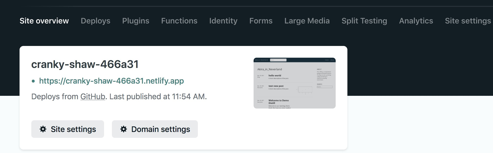

```{r setup, include=FALSE}
knitr::opts_chunk$set(echo = TRUE)
```

# Why blog
Record (personal benefits) and Share (public contribution, hopefully).


# Why use distill
- friendly for R markdown writers.
- convenient tool link: Rstudio -> Github -> Netlify

# First time setup

## install distill and create a R project

```{r eval=F}
# install distill package
BiocManager::install('distill')

library(distill)
create_blog(dir = "blog_distill", title = "Akira in Neverland")
# a new folder would be generated with following contents:
- _site.yml, file for blog configuration
- index.Rmd, file for blog list page
- about.Rmd, file for blog 'about' page
- _posts, folder for keeping user created Rmd files 
- _site, folder for deploy blog website
```


A prototype of the website is ready. 
You can view it by opening this file: `_site -> index.html`

This `index.html` file is your blog's home page.

To gain easy access writing new post, create a `New Project` in this `blog_distill` folder. Then, you would see a `blog_distill.Rpoj` file.

Next time, just double click `blog_distill.Rpoj`, it would automatically open Rstudio and direct you to this folder as [working environment](https://mgimond.github.io/ES218/The_R_environment.html).

## push to github

I find this tutorial very useful: https://bjungbogati.com.np/posts/creating-distill-blog/

I just followed its `4. Setup Distill Repository` step, create a new repo on github, then opened the terminal on my laptop:

```{r eval=F}
## create a repo for my blog
git init
git add -A
git commit -m 'added new blog'

git remote add origin https://github.com/xxx/xxx.git
git branch -M main

git push -f https://{your github personal access token}@github.com/xxx/xxx.git main
```

I changed my branch to `main` and used it as the default.

After `git push`, check the repo online for just updated contents.

## deploy by Netlify  

Netlify serves to host blog websites.
Follow `5. Host Your Distill Blog` on this [tutorial](https://bjungbogati.com.np/posts/creating-distill-blog/)

After Netlify deployment, you'd receive a URL for your blog:


## customize blog configuration

You could modify `_site.yml`, `index.Rmd` and `about.Rmd` files to customize your blog.

Some examples can be found [here](https://rstudio.github.io/distill/blog.html#next-steps).

My `site.yml` look like this:

```{r eval=F}
name: "Ming"
title: "Akira in Neverland"
description: |
  A personal blog
output_dir: "_site"

base_url: https://cranky-shaw-466a31.netlify.app/
navbar:
  right:
    - text: "Home"
      href: index.html
    - text: "About"
      href: about.html
output: distill::distill_article

collections:
  posts:
    #disqus: Akira_in_Neverland
    share: [twitter]
    citations: false
    custom: _custom.html
```

The `_custom.html` file follows [this file](https://rstudio.github.io/distill/blog.html#custom-html)

In `_site.yml`, the **share: [twitter]** enables reader to click and share your post on twitter.


# Publish a new post

Click **xxx.Rproj**, it would open Rstudio and direct you to the proper `working environment` automatically. 

```{r eval=F}
distill::create_post("hello world",author='Ming',slug='auto')
```
A new Rmd file titled **202x-xx-xx-hello-world** would be created and saved is in `_posts/` folder automatically.

Modify the rmd file as you like and while you are editing, feel free to **Knit** anytime you like.

This **Knit** would only generate xxx.html file in the `_posts/` folder.

When your writing is done, remember to rebuild the `_site/` folder to update the blog index page.

```{r eval=F}
library(rmarkdown)
render_site()
```

Have a look at the updated blog website by opening `_site/index.html`.

If you are happy with it, open your terminal and push it to github, then browser the URL generated by Netlify to see your blog~

# Modifications

## Modify R markdown file configuration

You can add features to the default Rmd file.
For example, enable **Table of contents** by changing the [headers](https://rstudio.github.io/distill/basics.html#table-of-contents)

## Create and modify theme for blog visualization

Follow tutorial [here](https://rstudio.github.io/distill/website.html#create-theme)

```{r eval=F}
distill::create_theme(name = "theme") 
```
A file titled **theme.css** would be created.

To apply your **theme.css** file, modify the **\_site.yml** file.

```{r eval=F}
name: "distill"
title: "Distill for R Markdown"
theme: theme.css
navbar:
  # (navbar definition here)
```  

## Enable Github Discussion 
Use the `giscus.html` downloaded from [pipinghotdata](https://github.com/shannonpileggi/pipinghotdata_distill),
and enable **Discussion** feature following the [instruction](https://docs.github.com/en/repositories/managing-your-repositorys-settings-and-features/enabling-features-for-your-repository/enabling-or-disabling-github-discussions-for-a-repository)

## Showcase of distill-powered blogs
The theme I used comes from [here](https://github.com/shannonpileggi/pipinghotdata_distill).

There are more showcases [here](https://jhelvy.github.io/distillery/showcase.html).

# Final words

*Shortcuts summary*

+ Create a new post

>distill::create_post("hello world",author='Ming',slug='auto')

+ Create a new Rmd file or make changes on old ones, remember to **Knit** them to update the post content.

+ When everything is done,`render_site` to keep **\_site** folder up-to-date.

>library(rmarkdown)

>render_site()

+ Open **\_site\/index.html** file and have a sneak peek~

+ Then push everything to your github repo.

You are all set!
Enjoy the cyperspace ;) 

# References
- https://rstudio.github.io/distill/blog.html
- https://themockup.blog/posts/2020-08-01-building-a-blog-with-distill/
- https://bjungbogati.com.np/posts/creating-distill-blog/
- https://rstudio.github.io/distill/basics.html
- https://jhelvy.github.io/distillery/showcase.html

```{r}
sessionInfo()
```


  