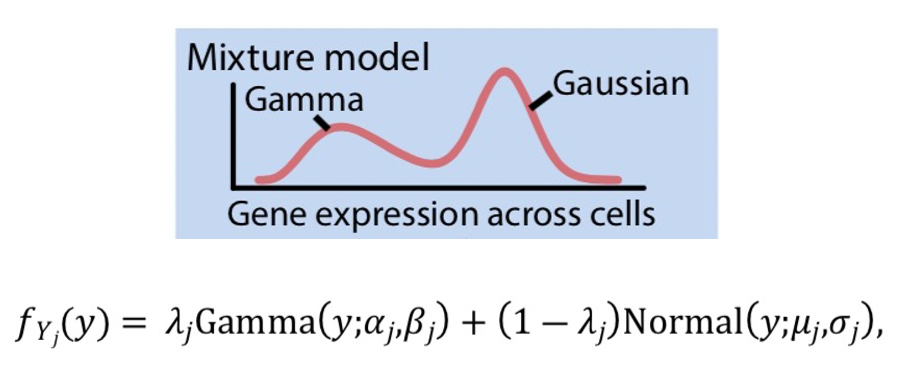

```{r setup, include=FALSE}
knitr::opts_chunk$set(echo = TRUE)
```


A Mixture model with two components: Gamma and Gaussian



Image source:

- Lin, Yingxin, et al. "Evaluating stably expressed genes in single cells." GigaScience 8.9 (2019): giz106.
- Wei Vivian Li, Yangzeng Li, “scLink: Inferring Sparse Gene Co-expression Networks from Single-cell Expression Data”.
Genomics, Proteomics & Bioinformatics, 2021


In this post, I'm gonna fit single cell data with a Gamma-Normal mixture model.

- simulate data following gamma-normal mixture model
- fit model and estimate parameters using code of `scSEGIndex.R` from the `scMerge` package 
- fit model and estimate parameters using code from the `scLink` package

## Simulate data following gamma-normal mixture model
```{r}
## simulate from a gamma-normal mixture model and use the provide function to fit
#https://stats.stackexchange.com/questions/52344/sampling-from-the-normal-gamma-distribution-in-r
xg <- seq(0.001, 50, length.out = 300)
pi=0.7; #proportion of gamma distribution part
rho_iter=1-pi; #proportion of normal distribution part
mu_iter=10;sig2_iter=1;
alpha_iter=1; beta_iter=1;

c1g <- rho_iter * stats::dnorm(xg, mu_iter, sqrt(sig2_iter))
c2g <- (1-rho_iter) * stats::dgamma(xg, shape = alpha_iter, rate = beta_iter)
fg <- rho_iter * stats::dnorm(xg, mu_iter, sqrt(sig2_iter)) +
       (1-rho_iter)* stats::dgamma(xg, shape = alpha_iter,rate = beta_iter)

par(mfrow=c(1,1))
plot(xg,type='n',xlim=c(min(xg),max(xg)),ylim=c(0,max(fg)))
graphics::lines(xg, c1g, col = scales::alpha("red", 0.6), lwd = 2)  #Normal Lines
graphics::lines(xg, c2g, col = scales::alpha("blue", 0.6), lwd = 2)  #Gamma lines
graphics::lines(xg, fg, col = scales::alpha("black", 0.6), lwd = 2)  #Mixture model line

```

A random generator function following gamma-normal mixture model.

Note: I use pi to denote the proportion of Gamma distribution and (1-pi) for the Normal part.

```{r}
#simulation scheme: param.est.pnb.R function from https://github.com/anlingUA/scDoc 
#f(y) = pi*Gamma(y;alpha,beta) +(1-pi)*Normal(y;mu,sigma)
r_gamma_normal <- function(n, pi, mu, sigma2, alpha, beta) {
  if (length(n) > 1) n <- length(n)
  u <- runif(n) 
  y <- apply(as.matrix(u), 1, function(x) 
    ifelse(x<=pi, rgamma(1, shape=alpha, rate=beta),
           rnorm(1, mu,sd=sqrt(sigma2)) ) )
     
  #y1 <- rnorm(floor(n*pi), mu, sd=sqrt(sigma2))
  #y2 <- rgamma(n-length(y1), shape=alpha, rate=beta)
  #y=c(y1,y2)
  return(y)
}
y=r_gamma_normal(n=2000,pi=0.3,mu=10,sigma2=1,alpha=1,beta=1)
# gamma: shape=k,scale=theta
# alpha = k, beta=1/theta
hist(y)
```


## fit model and estimate parameters 
### using code from `scSEGIndex.R`

source code: https://github.com/SydneyBioX/scMerge/blob/master/R/scSEGIndex.R

```{r}
#code copied from: https://github.com/SydneyBioX/scMerge/blob/master/R/scSEGIndex.R

gammaNormMix <- function(data, thresh = 1e-07, maxiter = 10000, 
                         removeZeroes = TRUE, plot = TRUE, hist = TRUE, hist_col = "light cyan", 
                         verbose = FALSE, forceExponential = FALSE, calculateAreaDifference = FALSE, 
                         minDataPoints = 5, onlyAddCurves = FALSE, addContextData = FALSE, 
                         contextData = NULL) {
  
  
  # fitting a 2 component normal and gamma mixture model
  
  # add other data to fit the model with as well, but only
  # return the classification for those we're interested in
  
  if (addContextData) {
    nOriginal = length(data)
    data <- c(data, contextData)
  }
  
  # assume all values exactly zero already belong to the gamma
  # comp and remove them from the EM algorithm
  
  if (removeZeroes) {
    nonZeroInd = which(data > 0)
    x = data[nonZeroInd]
  } else {
    x = data
  }
  
  if (length(x) < minDataPoints) {
    if (verbose) 
      cat("Not enough data points to fit mixture model!")
    return(NA)
  }
  
  # initiate
  n = length(x)
  z = stats::rbinom(n, 1, 0.5)
  if(sum(z) == 0){z[1] = 1} ## Break out of a sequence of zeroes error
  z_iter = z
  mu = -100
  mu_iter = 10
  sig2 = -100
  sig2_iter = 0
  alpha = -100
  alpha_iter = 1
  beta = -100
  beta_iter = 1
  rho = -100
  rho_iter = 0.5
  niter = 0
  
  while (any(c(abs(mu - mu_iter) > thresh, abs(sig2 - sig2_iter) > 
               thresh, abs(alpha - alpha_iter) > thresh, 
               abs(beta - beta_iter) > thresh, 
               abs(rho - rho_iter) > thresh)) & 
         (niter < maxiter)) {
    
    # save old parameters
    mu = mu_iter
    sig2 = sig2_iter
    alpha = alpha_iter
    beta = beta_iter
    rho = rho_iter
    if (forceExponential) 
      alpha_iter = 1
    
    niter = niter + 1
    
    # M step
    mu_iter = sum(z_iter * x)/sum(z_iter)
    sig2_iter = sum(z_iter * (x - mu_iter) * (x - mu_iter))/sum(z_iter)
    if (sig2_iter <= 0 | is.na(sig2_iter)) 
      sig2_iter = 1e-11
    beta_iter = alpha_iter * sum(1 - z_iter)/sum((1 - z_iter) * 
                                                   x)
    if (beta_iter <= 0 | is.na(beta_iter)) 
      beta_iter = 3
    if (!forceExponential) {
      alpha_iter = distr::igamma(sum((log(beta_iter) + 
                                        log(x)) * (1 - z_iter))/sum(1 - z_iter))
    }
    if (alpha_iter > 150 | is.na(alpha_iter)) 
      alpha_iter = 150
    rho_iter = sum(z_iter)/n
    
    
    # E step
    eta_iter = -0.5 * log(2 * pi * sig2_iter) - ((x - mu_iter) * 
                                                   (x - mu_iter))/(2 * sig2_iter) - alpha_iter * log(beta_iter) + 
      log(gamma(alpha_iter)) - (alpha_iter - 1) * log(x) + 
      beta_iter * x + log(rho_iter/(1 - rho_iter))
    z_iter = 1/(1 + exp(-eta_iter))
    
    if (verbose) 
      cat(niter, mu_iter, sqrt(sig2_iter), alpha_iter, 
          beta_iter, rho_iter, "\n")
  }
  
  
  ll <- sum(log(rho_iter * stats::dnorm(x, mu_iter, sqrt(sig2_iter)) + 
                  (1 - rho_iter) * stats::dgamma(x, shape = alpha_iter, 
                                                 rate = beta_iter)))
  
  
  xg <- seq(0, max(x) + 1, length.out = 300)
  c1g <- rho_iter * stats::dnorm(xg, mu_iter, sqrt(sig2_iter))
  
  c2g <- (1 - rho_iter) * stats::dgamma(xg, shape = alpha_iter, 
                                        rate = beta_iter)
  fg <- rho_iter * stats::dnorm(xg, mu_iter, sqrt(sig2_iter)) + 
    (1 - rho_iter) * stats::dgamma(xg, shape = alpha_iter, 
                                   rate = beta_iter)
  
  if (plot) {
    if (hist) {
      hist(x, probability = TRUE, col = hist_col, breaks = 50, 
           main = NA, xlab = NA, ylab = "Density (zeroes removed)", 
           ylim = c(0, 0.6), xlim = c(0, 20))
    }
    if (!onlyAddCurves) {
      graphics::lines(stats::density(x, from = 0), lty = 2, 
                      lwd = 2, col = scales::alpha("darkgrey", 0.6))
    }
    graphics::lines(xg, c1g, col = scales::alpha("red", 0.6), lwd = 2)  #Normal Lines
    graphics::lines(xg, c2g, col = scales::alpha("blue", 0.6), lwd = 2)  #Gamma lines
    graphics::lines(xg, fg, col = scales::alpha("black", 0.6), lwd = 2)  #Mixture model line
    
    if (onlyAddCurves) 
      return(list(xg = xg, c1g = c1g, c2g = c2g, fg = fg))
  }
  if (calculateAreaDifference) {
    f1 <- stats::approxfun(xg, (stats::approxfun(stats::density(x, 
                                                                from = 0)))(xg) - fg)
    # piecewise linear function
    f2 <- function(x) abs(f1(x))
    # take the positive value
    AreaDifference = stats::integrate(f2, min(x[x != 0]), 
                                      max(x))$value
  } else {
    AreaDifference = NULL
  }
  
  if (removeZeroes) {
    z = rep(0, length(data))
    z[nonZeroInd] <- z_iter
  } else {
    z = z_iter
  }
  
  # force prob expression values above the max to stay the same
  # value
  maxdata = data[which.max(z)]
  z[which(data > maxdata)] <- max(z)
  
  
  
  if (addContextData) {
    z <- z[seq_len(nOriginal)]
  }
  if (plot) {
    if (addContextData) {
      graphics::points(data[seq_len(nOriginal)], z * 0, 
                       pch = "|", cex = 1, col = scales::alpha(grDevices::rgb(z, 
                                                                              0, 1 - z), 0.4))
    } else {
      graphics::points(data, z * 0, pch = "|", cex = 1, 
                       col = scales::alpha(grDevices::rgb(z, 0, 1 - z), 0.4))
    }
  }
  model_bic <- bic(ll, n, 5)
  model_aic <- aic(ll, 5)
  model_icl_bic <- icl_bic(ll, z, n, 5)
  return(list(probExpressed = z, propExpressed = n * rho_iter/length(data), 
              numExpressed = length(which(z > 0.5)), mu = mu_iter, 
              sd = sqrt(sig2_iter), alpha = alpha_iter, beta = beta_iter, 
              rho = rho_iter, niter = niter, loglik = ll, BIC = model_bic, 
              AIC = model_aic, ICL_BIC = model_icl_bic, AreaDifference = AreaDifference))
}
bic <- function(loglik, n, p) {
  return(-2 * loglik + p * log(n))
}
aic <- function(loglik, p) {
  return(-2 * loglik + 2 * p)
}  #Tend to fit more component
icl_bic <- function(loglik, postprob, n, p) {
  postprob <- postprob[postprob > 0]
  EN = -sum(postprob * log(postprob))
  return(-2 * loglik + 2 * EN + p * log(n))
}

y=r_gamma_normal(n=2000,pi=0.3,mu=10,sigma2=1,alpha=1,beta=1)
sum(y==0)
out=gammaNormMix(data=y,plot=T)
#red: fitted normal line
#blue: fitte gamma line
#black: mixture model line
out$rho
out$mu
out$sd
out$alpha
out$beta
```


### using code from `scLink`
source code: https://github.com/Vivianstats/scLink

```{r}
### estimate parameters in the mixture distribution
#https://github.com/Vivianstats/scLink/blob/master/R/get_mix_parameters.R
library(parallel)
ncores=2;
source('get_mix_parameters.R')

y1=r_gamma_normal(n=2000,pi=0.3,mu=10,sigma2=1,alpha=1,beta=1)
y2=r_gamma_normal(n=2000,pi=0.1,mu=6,sigma2=2,alpha=0.5,beta=1)
count=t(data.frame(y1=y1,y2=y2)) 
dim(count) #two genes, each gene has 2000 cell info
pa = get_mix_parameters(count, ncores = 2) #using log.mat for fit
pa
# rate is the proportion of gamma.distribution of the mixture
```

## fit mixture model using single cell data in fly

```{r}
## read in small loomR file
library(loomR)
ds <- connect('wing_2celltypes_10x.loom')
mat <- t(ds$matrix[,])
gene.names <- ds$row.attrs$Gene[]
cell.names <- ds$col.attrs$CellID[]
cell.types<-ds$col.attrs$cell.type[]
sex.labels<-ds$col.attrs$sex.label[]
ds$close_all()

dim(mat)
length(gene.names)
length(cell.names)
table(cell.types)
table(sex.labels)

# filter out some genes
rownames(mat)=gene.names
colnames(mat)=cell.names
filter <- rowSums(mat>5)>5
table(filter)
umi.mat<- mat[filter,]
dim(umi.mat) #cell by gene

scale.factor=1e06;
count=as.matrix(umi.mat)
cpm.mat = sweep( count, MARGIN = 2, scale.factor/colSums( count), FUN = "*")

cell.size=Matrix::colSums(umi.mat)
head(umi.mat[,1]/cell.size[1]*scale.factor)
cpm.mat[1:5,1]

# transpose to cell by gene matrix
t.log.cpm.mat = t(log(cpm.mat+1,base=2))
t.log.cpm.mat1= t(log10(cpm.mat+1))
t.log.cpm.mat2 = t(log10(cpm.mat+1.01))

par(mfrow=c(1,3))
pick.gene.i=c(10,20)
for(gene.i in pick.gene.i){
  #gene.i=10;
  #hist(t.log.cpm.mat[,10],main='log2(cpm+1)')
  #hist(t.log.cpm.mat1[,10],main='log10(cpm+1)')
  hist(umi.mat[gene.i,],main='UMI')
  hist(cpm.mat[gene.i,],main='CPM')
  hist(t.log.cpm.mat2[,gene.i],main='log10(cpm+1.01)')
}


mat=t.log.cpm.mat1
log.mat=t.log.cpm.mat2
#log10(1.01)
#sum(log.mat <= log10(1.01))
#sum(log.mat<log10(1.01)) #0 
#sum(log.mat<=log10(1.01)) #ok
log.mat[log.mat <= log10(1.01)] = log10(1.01) #for safe, as floating number computation, small minus value

dim(log.mat) #302cell by 438 gene
library(parallel)
pa = get_mix_parameters(t(log.mat), ncores = 2) #using log.mat for fit
dim(pa) #number of genes and the 5 estimated paras
head(pa)

# select genes to plot obs and predicted values
gene.para=pa[pick.gene.i,] #estiamted para values for gene.i
# simulate distribution based on estiamted parameters
# as in r_gamma_normal(), pi is the proportion of Normal in the mixture.
# get_mix_parameters() return rate as the proportion of gamma in the mixture.
for(i in 1:nrow(gene.para)){
  simu.dat=r_gamma_normal(n=nrow(log.mat),pi=1-gene.para[i,1], mu=gene.para[i,4],sigma2=gene.para[i,5]^2,alpha=gene.para[i,2],beta=gene.para[i,3])
  
  par(mfrow=c(2,1))
  hist(t.log.cpm.mat2[,pick.gene.i[i]],main='log10(cpm+1.01)')
  hist(simu.dat,main=paste0('simu.data based on estimated parameter\ndetection.rate=',round(1-gene.para[i,1],4), '\n',paste(names(gene.para[i,]),collapse = ';'), '\n',paste(round(gene.para[i,-1],2),collapse = ';')),cex.main=1)
}

## based on estiamted gene_wise parameters
## calcualte non-detection rate for each gene in each cell
I = ncol(log.mat) #number of genes
J= nrow(log.mat) #number of cells
### calculate cell-wise dropout rate for each gene
droprate = sapply(1:I, function(i) {
  if(is.na(pa[i,1])) return(rep(0,J))
  wt = calculate_weight(log.mat[, i], pa[i, ]) #https://github.com/Vivianstats/scLink/blob/master/R/get_mix_parameters.R
  return(wt[, 1])
})
dim(droprate) #cell by gene
droprate[1:3,1:3] #this measures non-detected/dropout rate
table(as.numeric(droprate))
```


```{r}
sessionInfo()
```
