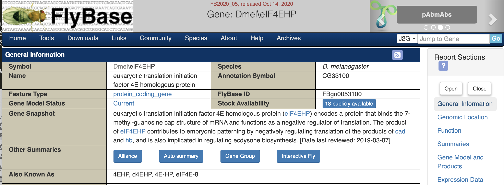
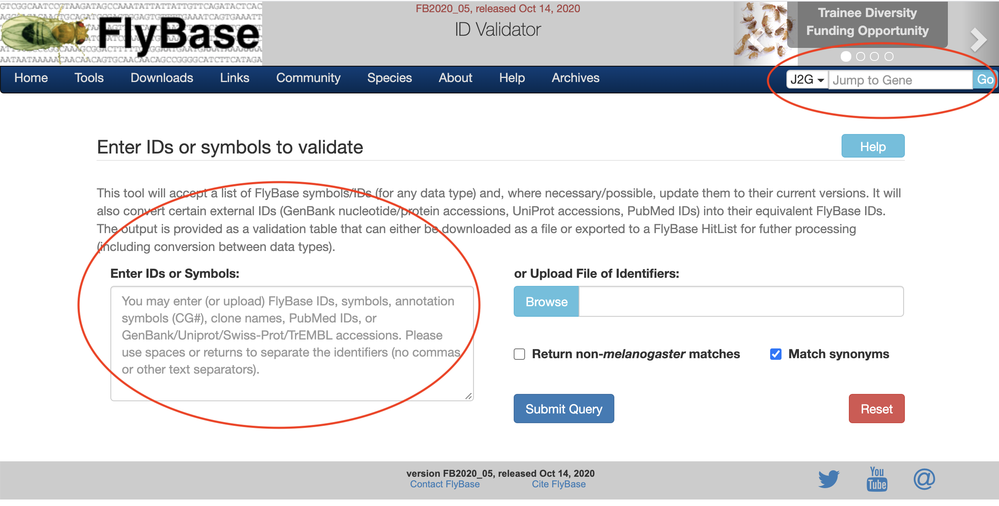

```{r setup, include=FALSE}
knitr::opts_chunk$set(echo = TRUE,message = F,warning = F) #cache = TRUE)
```

# Motivation
When I was analyzing single cell transcriptome data in fly, I noticed datasets from different studies sometimes refer to the same fly gene with different gene names. 

For example, in fly embryo scRNA-seq dataset [dataset](https://www.ncbi.nlm.nih.gov/geo/query/acc.cgi?acc=GSE95025), there is one gene named `4EHP`, and in fly whole brain scRNA-seq [dataset](https://www.ncbi.nlm.nih.gov/geo/query/acc.cgi?acc=GSE107451), this gene is referred to as `eIF4EHP`.

At first, I used R package `AnnotationDbi` to extract more information about these two genes, see if it would be enough to make an connection between these two genes.

```{r error=TRUE }
library(AnnotationDbi)
library(org.Dm.eg.db,verbose=F,quietly=T)
AnnotationDbi::select(org.Dm.eg.db,
            keys=c('4EHP','eIF4EHP'),keytype="SYMBOL",c("FLYBASE","GENENAME"))
```

The returned data frame showed no available matching for gene `4EHP`.

Then I went to **FlyBase** website and searched gene `4EHP`.
It showed clearly that `4EHP` is exactly `eIF4EHP`.
(check out the **Also Known As** row)



As I was comparing some gene properties across studies, this gene name inconsistency may bias my result in some way.

To cope with this problem, I turned to a tool offered by FlyBase called [ID Validator](https://flybase.org/convert/id). This tool maps any input fly gene name into its the current, stable version.

There is a wiki page for this tool: https://wiki.flybase.org/wiki/FlyBase:ID_Validator

With this online tool, it's possible to validate all gene names across datasets before any further data processing, replacing old and out-dated gene names with new ones, making sure all gene names are up to date.
 
A easy workflow is:

- go to FlyBase -> [ID Validator](https://flybase.org/convert/id)
- paste gene names or upload a file containing input gene names
- download the output file and check the results

Easy as it is, I wondered if I could make this workflow more "smooth", like, implementing all above steps inside **R**.

Instead of changing working window to chrome -> upload file -> download file -> read in R and continue the analysis.

I'd like to 'talk' with FlyBase directly inside **R**

This requires some skills as connecting to a website and parsing a html file. With convenient functions from R package `rvest` and `XML`, things were made much easier to implement~

# Web scraper implementation

Here is how I make it happen:

```{r}
library(rvest)

url<-"http://flybase.org/convert/id"; #the url we'd like to 'talk' to
x=read_html(url)
session<-html_session(url) #set up a "channel" to talk
html_form(session) #have a look at the configuration of this 'channel'
```

Some explanations about above functions:

- **read_html**: input a url and it outputs the html content
- **html_session**: set up a session inside R, begin to talk with FlyBase.
- **html_form**: this function extracts boxes you see on the website that need user's input and give you some 'forms'. These 'forms' need to be filled and then submitted back to the website.

The tricky thing is: 
there are **two input boxes** on **ID Validator** website.



The first **J2G** input box one is useful if you want to search a specific gene and get detailed information about that gene.

The second **Enter IDs or Symbols** input box accpets gene names to be validated.

Let's to try both! We are gonna name the 1st box as **form1** and the 2nd box as **form2**. 
Then we feed one gene to **form1** and two genes to **form2**.

```{r}
form1<-html_form(session)[[1]]
form2<-html_form(session)[[2]]
form1
form2

form1<-set_values(form1, context =c('4EHP'))
form2<-set_values(form2, ids =c('4EHP A2bp1'))
form2<-set_values(form2, synonyms='checked')
```


As on the website, we'd like to check the box named '**Match synonyms**' to match as many gene names as possible.
We would just do the same inside **R**. The above code `form2<-set_values(form2, synonyms='checked')`, correponds to **Match synonyms** checkbox on the website.

Now we can submit the forms and see what we get back.

```{r}
result1 <- submit_form(session,form1)
result2 <- submit_form(session,form2,submit='.submit')
```

To 'see' the results, we need tools to read and parse xml file inside R.
You could also save the returned R object `result1` or `result2` into a local html file and browse it locally. 


```{r eval=F}
x1<-read_html(result1)
class(x1)
xml2::xml_name(x1)
xml2::xml_children(x1)
#xmlNode(x1)

## output this xml object to local 'test.html' file
sink("test.html");
xmlNode(x1)
sink()

browseURL('test.html')
```

As we only need gene ID validation information, it would be convenient to directly extract mapping table from the returned object `result2`. 
So we use function **read_html** to 'read' the returned html page first, then use function **html_table** to get the table.

```{r}
x2<-read_html(result2)
x2.out<-html_table(x2)
x2.out
df<-x2.out[[1]][-1,]
df
df[,2]
df[,3]
```

Nicely done!


```{r}
sessionInfo()
```


