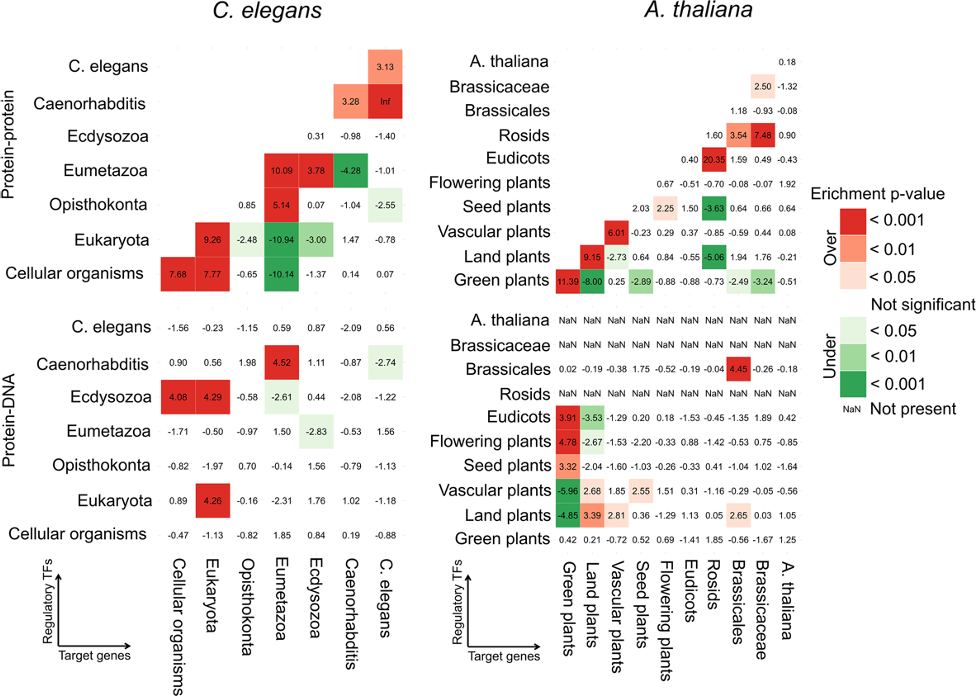

```{r setup, include=FALSE}
knitr::opts_chunk$set(echo = TRUE,message = F,warning = F) 
```


When I was reading a network analysis paper titled [Function, dynamics and evolution of network motif modules in integrated gene regulatory networks of worm and plant](https://academic.oup.com/nar/article/46/13/6480/5033160), I ran into this plot:



If we focus on one panel of the above figure, it shows a enrichment result, number in each cell is Z-score and each cell is colored by the significance level, with green meaning under-represented and red over-represented.

I wonder if I could make similar plots with some pseudo data in **R**.

Here we go~

------

First, let's generate some pseudo data. 

- We need two sets of data, one set is Z-score, and the other it Z-score associated p.values.
- I used `runif` function to generate 100 numbers from uniform distribution within range [-5,5] as Z-scores.
- And then used `pnorm` to calcualte the probabilites for each z-score following a Normal distribution N(0,1).

```{r}
library(ggplot2)
library(gridExtra)
options(stringsAsFactors = F)

## prepare z-score and pvalue matrix
set.seed(123)
dat=runif(100,min=-5,max=5)
dat.p=pnorm(dat)
plot(dat,dat.p,xlab='Z-score',ylab='cumulative probability');
mat.zscore=matrix(dat,ncol=10)
mat.pvalue=matrix(dat.p,ncol=10)
rownames(mat.zscore)=colnames(mat.zscore)=paste('node',1:10)
rownames(mat.pvalue)=colnames(mat.pvalue)=paste('node',1:10)
```

As I'm gonna use `ggplot` to draw heatmaps, `ggplot` handles data frame. I change matrix into data.frame and make a 'naive' plot.

```{r fig.width=16}
df.zscore=reshape2::melt(mat.zscore)
df.pvalue=reshape2::melt(mat.pvalue)
p1<-ggplot(df.zscore,aes(x=Var1,y=Var2,fill=value))+
  geom_tile()+geom_text(label=round(df.zscore$value,3))+theme_bw()+ggtitle('zscore')
p2<-ggplot(df.pvalue,aes(x=Var1,y=Var2,fill=value))+
  geom_tile()+geom_text(label=round(df.zscore$value,3))+theme_bw()+ggtitle('pvalue')
grid.arrange(p1,p2,ncol=2)
```

As you can see above, the default color scheme in ggplot is pretty boring.
Next, I combine the two data frames.

When combining data, it's important to take care of their orders, like, should row 1 in dataset 1 be combined with row 6 or row 9 in dataset 2?

To add a little twist, I intentionally shuffle the 2nd dataset, and then re-order it based on row information in dataset 1 before combining.

```{r}
## combine the two data.frame, jsut for demonstration, I shuffled df.pvalue
df.zscore$edge=paste(df.zscore$Var1,df.zscore$Var2)
df.pvalue$edge=paste(df.pvalue$Var1,df.pvalue$Var2)
df=df.zscore;

df.pvalue=df.pvalue[sample(1:nrow(df.pvalue),nrow(df.pvalue),replace = F),]
i=match(df.zscore$edge,df.pvalue$edge)
## make sure row order matches
sum(df.pvalue[i,]$edge==df.zscore$edge)
df.pvalue=df.pvalue[i,]
df$pvalue=df.pvalue$value
```

The goal is to show Z-score as text inside each cell, and color each cell based on p.value significance value.

Thus, we need to decide what is significant and how many significant levels we'd like to show.

I random select some cells and change them into ***NA***.
Then select three significant levels for both over-representation and under-represntation.

With `cut` function in **R**, it's easy to map continuous pvalues into exclusive, discrete significant level groups.

Each p.value corresponds to one and only one significant group, and this significant group information is added as one new column to the orginical data frame.

Then I select some discrete colors for each significant group and use ggplot `scale_fill_manual()` function to customize aesthetic colors.

```{r fig.width=12,fig.height==12}
set.seed(123)
i=sample(1:nrow(df),10,replace = F)
df[i,]$value=NA;df[i,]$pvalue=NA;
# sig.level: right tail area, over-represented: 0.95,0.99,0.999
# sig.level: left tail area, under-represented: 0.95,0.99,0.999
sig.cutoff=c(0.95,0.99,0.999) 
sig.cutoff=sort(unique(c(1-sig.cutoff,sig.cutoff)))
if(min(sig.cutoff!=0)){sig.cutoff=c(-10,sig.cutoff)} #you will see why in the below cut behavior
if(max(sig.cutoff!=1)){sig.cutoff=c(sig.cutoff,10)}
sig.cutoff
# default cut behavior: (,]
# you can use include.lowest to force [,]
# or use right = F, to force (,)
df$pvalue.group=
  cut(df$pvalue,breaks=sig.cutoff,right=T,include.lowest=T)
sum(table(df$pvalue.group))==sum(!is.na(df$pvalue)) #make sure, besides NA, no data.point is left out
table(df$pvalue.group)

## assign labels to these sig.levels
levels(df$pvalue.group)
my.direct=c(rep('under',3),'',rep('over',3));
my.sig=c('<0.001','<0.01','<0.05','Not sig','<0.05','<0.01','<0.001')
my.label=paste(my.direct,my.sig)
my.label
levels(df$pvalue.group)=my.label

ggplot(df,aes(x=Var1,y=Var2,fill=pvalue.group))+
  geom_tile()+geom_text(label=round(df$value,3))+
  theme_bw()

## select proper cell colors related to pvalues
library("RColorBrewer")
#display all colour schemes
display.brewer.all()

mycols=rev(brewer.pal(11,"RdYlGn"))
barplot(rep(1,length(mycols)),col=mycols)
mycol=c(mycols[c(1,3,5)],'grey90',mycols[c(7,9,11)])
barplot(rep(1,length(mycol)),col=mycol)

p1 = ggplot(df,aes(x=Var1,y=Var2,fill=pvalue.group))+
  geom_tile()+geom_text(label=round(df$value,3))+
  theme_bw()+
  scale_fill_manual(name='Enrichment p-value',values = mycol)
my_theme=theme( 
        panel.grid.major = element_blank(),
        panel.grid.minor = element_blank(),
        panel.border = element_blank(),
        panel.background = element_blank(),
        axis.ticks = element_blank(),
        axis.line = element_blank(),
        axis.text.x=element_text(size=14,angle=45,hjust=1),
        axis.text.y=element_text(size=14),
        axis.title=element_text(size=14,face="bold"),
        legend.title=element_text(size=14,face="bold"),
        legend.text=element_text(size=14));
p1+my_theme

p2 = ggplot(df,aes(x=Var1,y=Var2,fill=pvalue.group))+
  geom_tile()+geom_text(label=round(df$value,3))+
  theme_bw()+
  scale_fill_manual(name='Enrichment p-value',
                    labels = my.sig,
                    values = mycol)
p2+my_theme
```

Nicely done~


```{r}
devtools::session_info()
```
