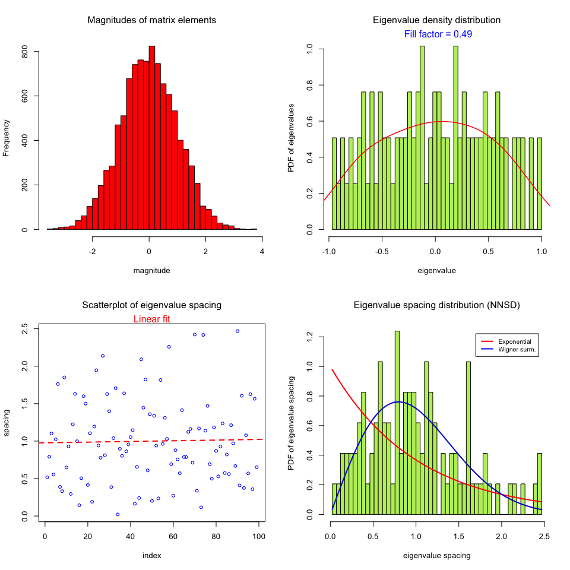

```{r setup, include=FALSE}
knitr::opts_chunk$set(echo = TRUE)
```


## R package `COGENT` assessing internal consistency

source code: https://github.com/lbozhilova/COGENT

Bozhilova, Lyuba V., et al. "COGENT: evaluating the consistency of gene co-expression networks." Bioinformatics 37.13 (2021): 1928-1929.

```{r}
library(COGENT)
library(ggplot2)
set.seed(101019)

splitData <- function(df, colIdx,propShared=0.5){
  sampleCount <- ncol(df)
  #colIdx <- sample.int(sampleCount)
  sharedSampleCount <- round(propShared*sampleCount)
  sharedColsIdx <- 1:sharedSampleCount
  specificSampleCount <- floor(0.5*(sampleCount-sharedSampleCount))
  
  s1=sharedSampleCount+1;
  e1=sharedSampleCount+1+specificSampleCount;
  s2=e1+1;
  e2=min(s2+specificSampleCount,sampleCount);
  df1 <- df[,colIdx[c(sharedColsIdx, s1:e1) ]]
  df2 <- df[,colIdx[c(sharedColsIdx, s2:e2)]]
  dfList <- list(df1, df2)
  return(dfList)
}
n.rep=10;
mat.count=matrix(runif(100*50),nrow=100)
splitData.mat=replicate(n.rep,sample.int(ncol(mat.count)))
dim(splitData.mat) #50 sample X 10 random shuffling
mat.out=list();
for(i in 1:n.rep){
  colIdx=splitData.mat[,i];
  dat=splitData(mat.count, colIdx,propShared=0.5)
  p1=coop::pcor(t(dat[[1]]))
  p2=coop::pcor(t(dat[[2]]))
  mat.out[[i]]=list(p1,p2)
}

thresholds<- c(0.7,0.9,0.95,0.99,0.995)
result=list()
for(rep in 1:length(mat.out)){
  abs.mat.out=lapply(mat.out[[rep]],abs)
  sapply(abs.mat.out,dim)
  out=sapply(thresholds,function(th){
    As=lapply(abs.mat.out,function(A){
      threshold <- quantile(A[upper.tri(A)], th, na.rm=TRUE)
      A <- 1*(A>=threshold); diag(A) <- 0; 
      A[is.na(A)]=0
      A
    });
    return(getEdgeSimilarityCorrected(As,type="expected")$correctedSimilarity)
  })
  result[[rep]]=out
}
df=Reduce(`rbind`,result) 
colnames(df)=as.character(thresholds)
rownames(df)=paste('rep',1:nrow(df))
df2=reshape2::melt(df)
colnames(df2)=c('rep','th','value')
ggplot(df2,aes(x=1-th,y=value,group=rep))+geom_point()+
  geom_smooth()+
  scale_y_continuous("Signal to noise score") +
  theme_classic()+
  scale_x_log10("Threshold cutoff", breaks=1-df2$th)
```

## R package `RMThreshold` based on Random Matrix Theory

R package `RMThreshold` manual: http://matstat.org/content_en/RMT/RMThreshold_Intro.pdf

1. Luo, Feng, et al. "Constructing gene co-expression networks and predicting functions of unknown genes by random matrix theory." BMC bioinformatics 8.1 (2007): 1-17.

2. Gibson, Scott M., et al. "Massive-scale gene co-expression network construction and robustness testing using random matrix theory." PloS one 8.2 (2013): e55871.

```{r}
#http://matstat.org/content_en/RMT/RMThreshold_Intro.pdf
library(RMThreshold)

# check if a matrix is well-conditioned for the RMT-based algorithm
## function: rm.matrix.validation
## eg1
set.seed(777)
random.mat <- create.rand.mat(size = 1000, distrib = "norm")$rand.matr
dim(random.mat) #1000 by 1000 symmetric matrix
isSymmetric(random.mat)
res <- rm.matrix.validation(random.mat)
str(res)
```



```{r eval=F}
## eg2
library(igraph); library(Matrix)
g <- erdos.renyi.game(1000, 0.1)
image(as.matrix(get.adjacency(g)))
rm.matrix.validation(as.matrix(get.adjacency(g)))

## eg3
matlist = list()
for (i in 1:4) matlist[[i]] = get.adjacency(erdos.renyi.game(250, 0.1))
mat <- bdiag(matlist)
dim(mat)
image(mat)
rm.matrix.validation(as.matrix(mat))

# Finding a candidate signal-noise separating threshold for the matrix
## function: rm.get.threshold
set.seed(777)
random.mat <- create.rand.mat(size = 1000, distrib = "norm")$rand.matr
res <- rm.get.threshold(random.mat)
str(res)

## 
matlist = list()
set.seed(979)
for (i in 1:4) matlist[[i]] = get.adjacency(erdos.renyi.game(250, 0.1))
mat <- bdiag(matlist)
dim(mat) #1000 by 1000
rm.matrix.validation(as.matrix(mat))

m <- mat != 0
g <- graph.adjacency(m, mode = "undirected")
clusters(g) # 4 clusters of size 250, as expected

set.seed(979)
mat1 = add.Gaussian.noise(as.matrix(mat), mean = 0, stddev = 0.1)
rm.matrix.validation(mat1)
m1 <- mat1 != 0
g1 <- graph.adjacency(m1, mode = "undirected")
clusters(g1) # a single big cluster with 1000 nodes

res <- rm.get.threshold(mat1) # noisy matrix as input
res

# running the main algorithm on a smaller interval of thresholds
res <- rm.get.threshold(random.mat, interval = c(2.5, 3.5))
cleaned <- rm.denoise.mat(mat1, 0.6)
matr <- cleaned != 0
g <- graph.adjacency(matr, mode = "undirected")
clusters(g) # 4 clusters reconstructed !

# Applying the identified threshold to the matrix
## rm.denoise.mat
cleaned.matrix <- rm.denoise.mat(random.mat, threshold = 3.2)
cleaned.matrix <- rm.discard.zeros(cleaned.matrix)
dim(cleaned.matrix)
m3 <- cleaned.matrix != 0
g3 <- graph.adjacency(m3, mode = "undirected")
clusters(g3)


```


```{r}
sessionInfo()
```
