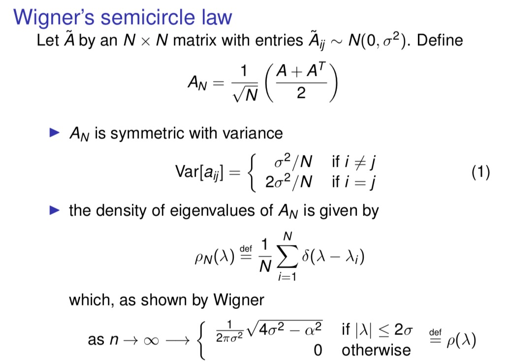
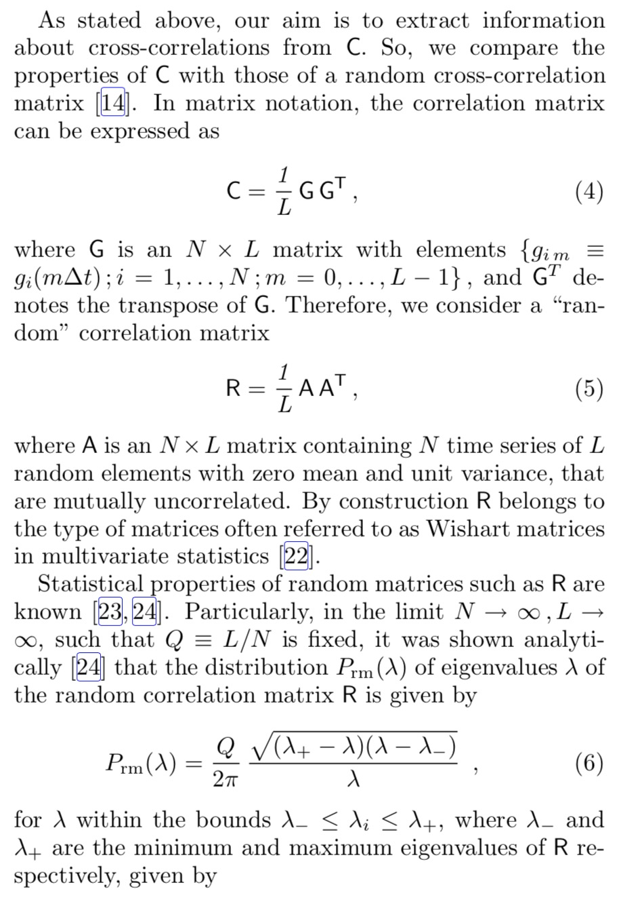
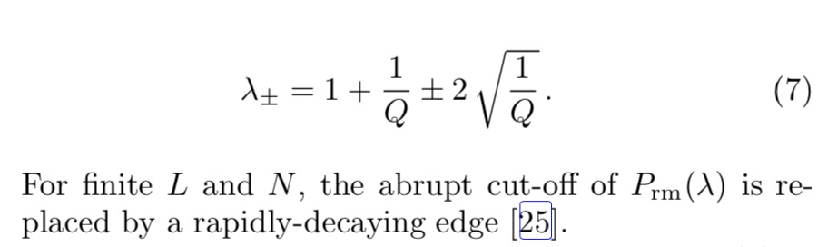
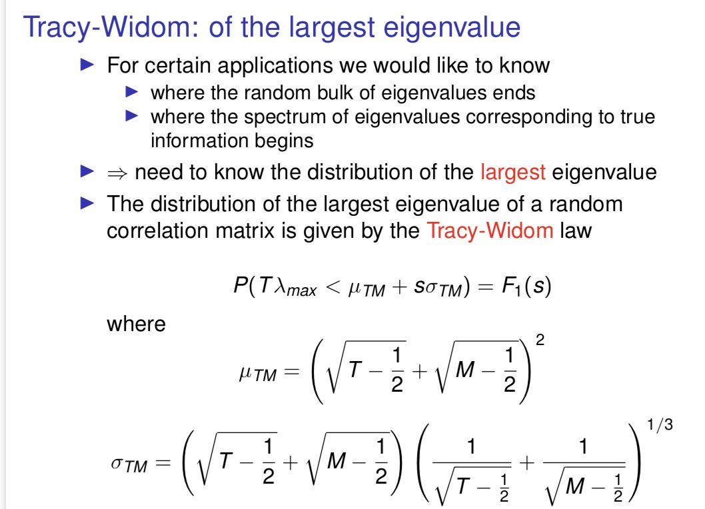
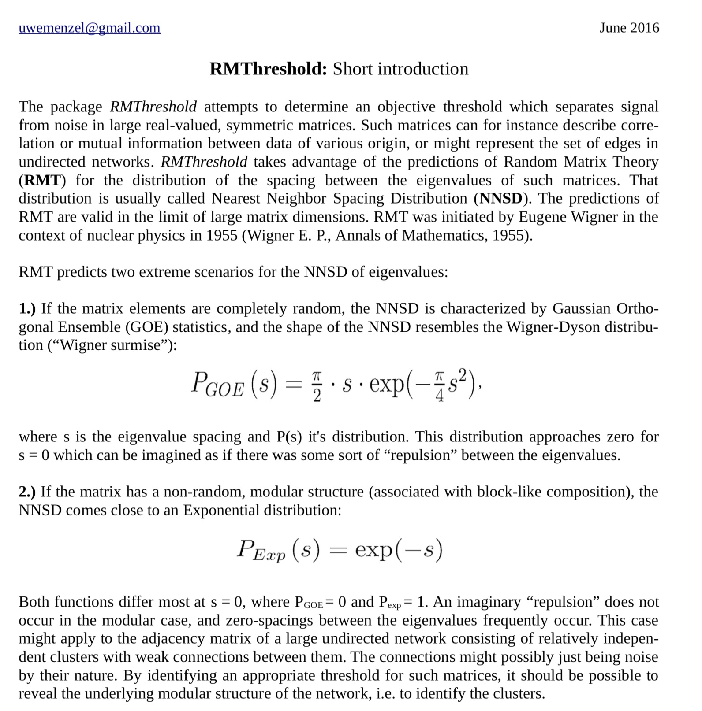

```{r setup, include=FALSE}
knitr::opts_chunk$set(echo = TRUE)
```

# Random matrix examples and the Wigner's semicircle law

## Example 1: Normal random symmetric matrix
- Generate a 5, 000 × 5, 000 random symmetric matrix with entries Aij ∼ N(0,1)
- Compute eigenvalues
- Draw the histogram of all eigenvalues.

```{r}
n=5000
m = array(rnorm(n^2),c(n,n));
m2 = (m+t(m))/sqrt(2*n); # Make m symmetric
lambda = eigen(m2, symmetric=T, only.values = T);
ev = lambda$values;
hist(ev, breaks=seq(-2.01,2.01,0.02),main=NA, xlab="Eigenvalues",freq=F)
````
## Example 2: Uniform random symmetric matrix
- Generate a 5,000 x 5,000 random symmetric matrix with entries Aij ∼ Uniform(0, 1)
- Compute eigenvalues
- Draw the histogram of all eigenvalues

```{r}
n = 5000;
mu = array(runif(n^2),c(n,n))
mu2 = sqrt(12)*(mu+t(mu)-1)/sqrt(2*n)
lambdau = eigen(mu2, symmetric=T, only.values = T)
ev = lambdau$values;
hist(ev, breaks=seq(-2.01,2.01,0.02), main=NA, xlab="Eigenvalues",freq=F)
```

**Pattern: the density of eigenvalues is a semicircle!**
  
## Wigner's semicircle law

  

# Random correlation matrices and the Marc̆henko-Pastur distribution

Describe the eigenvalue distribution of a correlation matrix

https://journals.aps.org/pre/abstract/10.1103/PhysRevE.65.066126




## Example: IID random normal returns
```{r}
t = 5000; #5000 time points
m = 1000; #1000 stocks
h = array(rnorm(m*t),c(m,t)); # Time series in rows, obs in row, feature in column
e = h %*% t(h)/t; # Form the correlation matrix
lambdae = eigen(e, symmetric=T, only.values = T);
ee = lambdae$values;
hist(ee, breaks =seq(0.01,3.01,.02), 
     #main='Empirical eigenvalue density',
     main='Empirical eigenvalue density with superimposed Marc ̆henko-Pastur density',
     xlab='Eigenvalues', freq=F)

# ratio of the matrix dimensions
Q = t/m
s=sd(as.numeric(h))
# boundaries
a=s^2*(1-sqrt(1/Q))^2
b=s^2*(1+sqrt(1/Q))^2
# theoretical MP distribution
MP<-function(x){
  Q/2/pi/s^2 * ( ((a-x)*(x-b))^0.5 / x )
}
#pos=seq(min(ee),max(ee),length=100);
pos=seq(0,3,length=200);
lines(pos,MP(pos),type='l',col='red',lwd=2)
```

Compare the empirical eigenvalue density with theoretical Marc̆henko-Pastur density with different matrix sizes.

```{r}
MP_size_mt<-function(m,t){
  #t = 5000; #5000 time points
  #m = 1000; #1000 stocks
  h = array(rnorm(m*t),c(m,t)); # Time series in rows, obs in row, feature in column
  e = h %*% t(h)/t; # Form the correlation matrix
  lambdae = eigen(e, symmetric=T, only.values = T);
  ee = lambdae$values;
  hist(ee, breaks =seq(0.01,3.01,.02), 
       #main='Empirical eigenvalue density',
       main=paste0(m,'x',t,'\nEmpirical vs MP'),
       xlab='Eigenvalues', freq=F)
  
  # ratio of the matrix dimensions
  Q = t/m
  s=sd(as.numeric(h))
  # boundaries
  a=s^2*(1-sqrt(1/Q))^2
  b=s^2*(1+sqrt(1/Q))^2
  # theoretical MP distribution
  MP<-function(x){
    Q/2/pi/s^2 * ( ((a-x)*(x-b))^0.5 / x )
  }
  #pos=seq(min(ee),max(ee),length=100);
  pos=seq(0,3,length=200);
  lines(pos,MP(pos),type='l',col='red',lwd=2)
}
MP_size_mt(m=1000,t=5000)
MP_size_mt(m=100,t=500)
MP_size_mt(m=10,t=50)
```

MP densities depends on Q = t/m

```{r}
out=list()
s=1
for(Q in c(1,2,5)){
  # boundaries
  a=s^2*(1-sqrt(1/Q))^2
  b=s^2*(1+sqrt(1/Q))^2
  # theoretical MP distribution
  MP<-function(x){
    Q/2/pi/s^2 * ( ((a-x)*(x-b))^0.5 / x )
  }
  pos=seq(0,5,length=1000);
  out[[as.character(Q)]]=MP(pos)
}
plot(0,0,xlim=c(0,5),ylim=c(0,1.2),type='n');
cl=rainbow(3)
for(i in 1:length(out)){
  lines(pos,out[[i]],col=cl[i],type='l',lwd=2)
}
legend("topright", legend = paste('Q',names(out)), col=cl, pch=1) # optional legend
```

## Applications
- denoise single cell data
  + Aparicio, Luis, et al. "A random matrix theory approach to denoise single-cell data." Patterns 1.3 (2020): 100035.
    https://rabadan.c2b2.columbia.edu/html/randomly/
- selecting the number of components in ICA
  + Teschendorff, Andrew E., Joanna Zhuang, and Martin Widschwendter. "Independent surrogate variable analysis to deconvolve confounding factors in large-scale microarray profiling studies." Bioinformatics 27.11 (2011): 1496-1505.
  + Wang, Weixu, et al. "Independent component analysis based gene co-expression network inference (ICAnet) to decipher functional modules for better single-cell clustering and batch integration." Nucleic acids research 49.9 (2021): e54-e54.

# The Tracy-Widom law

**The distribution of the largest eigenvalue of a random correlation matrix**



## Applications

- detect structure in genetic data
  + Patterson, Nick, Alkes L. Price, and David Reich. "Population structure and eigenanalysis." PLoS genetics 2.12 (2006): e190.
- selecting the number of PC components in a PCA analysis
  + Wang, Lin, Wei Zhang, and Qizhai Li. "AssocTests: an R package for genetic association studies." Journal of Statistical Software 94.5 (2020): 1-26.

```{r}
AssocTests::tw(eigenvalues = c(5, 3, 1, 0), eigenL = 4, criticalpoint = 2.0234)
#eigenvalues: a numeric vector whose elements are the eigenvalues of a matrix. The values should be sorted in the descending order.
#eigenL: the number of eigenvalues.
#criticalpoint: a numeric value corresponding to the significance level. If the significance level is 0.05, 0.01, 0.005, or 0.001, the criticalpoint should be set to be 0.9793, 2.0234, 2.4224, or 3.2724, accordingly. The default is 2.0234.
```

# NNSD, Distribution of Nearest-Neighbor eigenvalue Spacings.
the distribution of the spacing between the eigenvalues

R package `RMThreshold`: https://github.com/cran/RMThreshold
https://github.com/cran/RMThreshold/blob/master/inst/doc/RMThreshold_Intro.pdf



## Application: Use NNSD to threshold a correlation matrix

- Luo, Feng, et al. "Constructing gene co-expression networks and predicting functions of unknown genes by random matrix theory." BMC bioinformatics 8.1 (2007): 1-17.
- Gibson, Scott M., et al. "Massive-scale gene co-expression network construction and robustness testing using random matrix theory." PloS one 8.2 (2013): e55871.
- RMThreshold: Signal-Noise Separation in Random Matrices by using Eigenvalue Spectrum Analysis, https://cran.r-project.org/web/packages/RMThreshold/index.html
- Wang, Haiying, et al. "Integrated metagenomic analysis of the rumen microbiome of cattle reveals key biological mechanisms associated with methane traits." Methods 124 (2017): 108-119.


References:
- https://www.stats.ox.ac.uk/~cucuring/
  [Lecture 4: PCA in high dimensions, random matrix theory and financial applications
Foundations of Data Science: Algorithms and Mathematical Foundations](http://www.stats.ox.ac.uk/~cucuring/Lecture_4_PCA_RMTX_Finance.pdf)

- Plerou, Vasiliki, et al. "Random matrix approach to cross correlations in financial data." Physical Review E 65.6 (2002): 066126.


```{r}
sessionInfo()
```

