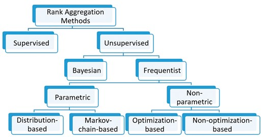
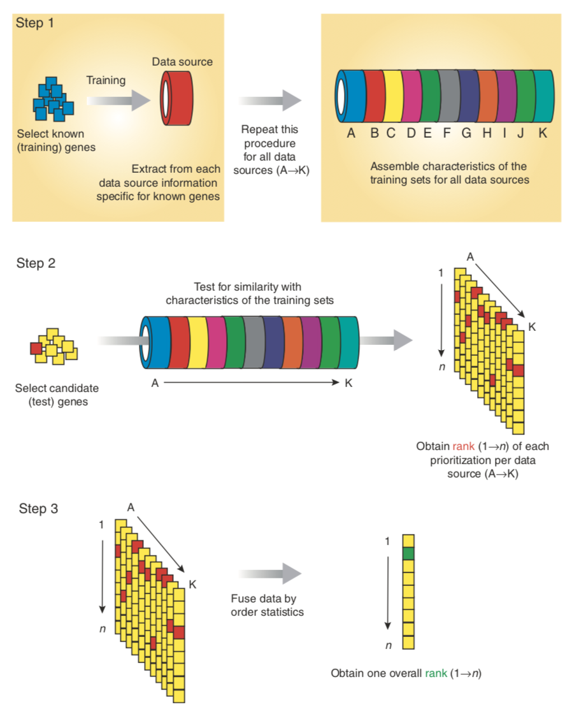
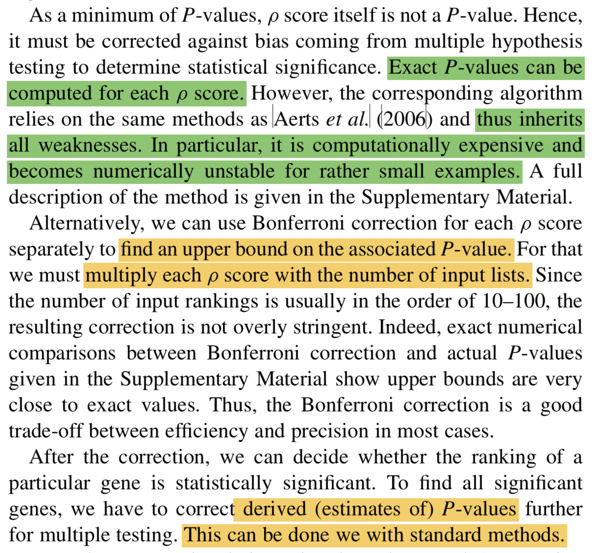

```{r setup, include=FALSE}
knitr::opts_chunk$set(echo = TRUE)
```

# Overview



# Intro

The first time I came across `rank aggregation` was from a paper titled [A Gene-Coexpression Network for Global Discovery of Conserved Genetic Modules](https://pubmed.ncbi.nlm.nih.gov/12934013/) by Stuart Kim in 2003.

This is one of those early papers proposing new analytical tools to extract biological information from omics data.

This paper caught my attention as it used gene correlations to infer *gene functions*, as gene function knowledge could be ***learned*** from three sources: genetic evidence, evolutioanry evidence, biochemical evidence (ref: [Defining functional DNA elements in the human genome](https://www.pnas.org/doi/10.1073/pnas.1318948111)).

By assembling microarray datasets from four species (human, fly, worm, yeast), it used 'recurrently' highly correlated gene pairs conserved across species to infer gene functions. 

Specifically, it first calculated gene correlations within each species and assigned a **rank** to each gene pair. Then for each gene pair, there is a ranking vector composed of ranks among datasets.

How to determine if a gene pair is `significantly` highly correlated across datasets?

In the supplementary material, this paper proposed a probabilistic model.

It first transformed a ranking vector into a ranking ratio vector, dividing each rank by the total number of gene pairs in a dataset, ($r_1, r_2, ..., r_n$).

If each $r_s$ was drawn indepently and uniformly, the P-value of the observed ranking ratio vector could be computed from a joint cumulative distribution of an n-dimensional order statistic:
$P(r_1,r_2,...,r_n) = n!\int_{0}^{r1}\int_{s1}^{r2}...\int_{s_{n-1}}^{r_n}ds_1ds_2...ds_n$

With this equation, the author used an recursive formula to efficiently compute the P-value.

This approach looks intuitive and direct, the `rank aggregation` analysis they employed actually entailed more implications.

# Distribution-based Rank Aggregation

Then in 2006, a method [paper](https://www.nature.com/articles/nbt1203) on *nature biotechnology* generalized this `rank aggregation` idea to be applied in much broader contexts.

The problem formulation was as follows:
if you have information about gene importance from multiple data sources, how to robustly and efficiently integrate these information and give a final importance score for each gene.

This `gene prioritization` problem is nicely visualized by their Figure 1.




The math formula for calculating probabilites from an N-dimensional order statistic are exactly the same as the 2003 paper, but they designed a more efficient and accurate computation algorithm.

Along with this paper, they released a software package *Endeavour* implementing the algorithm, which is a user-friendly tool in those "early" bioinformatic world. But now, it's *R* or *Python* universe~

# R package implementing rank aggregation

Actually, there are several R packages performing rank aggregation analysis, as reviewer in this [paper](https://academic.oup.com/bib/article/20/1/178/4091291). A 'walk-through' map can be found at the begining of this post.

Here I use R package `RobustRankAggreg` as a show case.

This package implements several different algorithms to calculate P values using the function [`aggregateRanks`](https://rdrr.io/cran/RobustRankAggreg/man/aggregateRanks.html)

Suppose you have s set of items, all of them or subset of them were separately ranked from different data sources. After ranking, you got a input list of ranking vectors.

For the distribution based method P value, `aggregateRanks(..,method='RRA'...)` would give each item a Score, which is close to P value but not exact P value.

Refer to the original publication:


In practice, use the number of input list (the number of data sources) to obtain the upper bound of P value for each item, then use 'BH' to perform multiple-testing correction.


R code demo:

```{r}
library(RobustRankAggreg)
data(cellCycleKO)
r = rankMatrix(cellCycleKO$gl, N = cellCycleKO$N)
dim(r) #item in row, data source in column
r[1:3,1:4]
ar = aggregateRanks(rmat = r,method='RRA',full=T)
head(ar)
dim(ar) #2372 features ranked by Score or P values

ar$derive.p.value=ar$Score*nrow(r); #tested list number
ar$adjust.p= p.adjust(ar$derive.p.value,method='BH')
par(mfrow=c(1,3))
hist(ar$Score)
hist(ar$derive.p.value)
hist(ar$adjust.p)
```


# RandomNote
The corresponding author, Stuart Kim of the 2003 Science paper, is also the corresponding author of a Aging research paper [Aging Mice Show a Decreasing Correlation of Gene Expression within Genetic Modules](https://journals.plos.org/plosgenetics/article?id=10.1371/journal.pgen.1000776), leveraging microarray data and employing a network analysis approach to study aging from a systems biology perspective. 

The first author, Stein Aerts of the 2006 nature biotechnology paper, is the corresponding author of the first [Single-cell Aging Fly Brain Atlas paper](https://www.sciencedirect.com/science/article/pii/S0092867418307207?via%3Dihub). With machine learning algorithms and single-cell techniques, his lab is generating new knowledge of fly brains.

I think their trajectories are pretty illuminating, as simple ideas in early careers gradually mature and develop into something huge.

# References
- Stuart, Joshua M., et al. "A gene-coexpression network for global discovery of conserved genetic modules." science 302.5643 (2003): 249-255.
- Aerts, Stein, et al. "Gene prioritization through genomic data fusion." Nature biotechnology 24.5 (2006): 537-544.
- Kolde, Raivo, et al. "Robust rank aggregation for gene list integration and meta-analysis." Bioinformatics 28.4 (2012): 573-580.

```{r}
sessionInfo()
```


